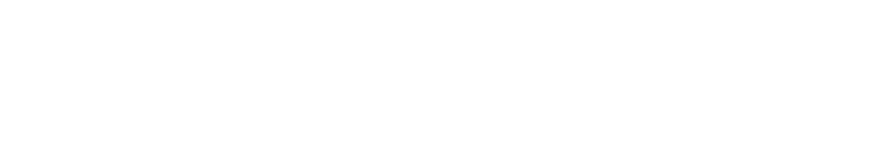

# brickmerge® Preise

[](https://github.com/pke/brickmerge-userscript)


GreaseMonkey UserScript welches den Bestpreis von brickmerge® zu Online Shop LEGO® Produktseiten hinzufügt.

<a href="https://greasyfork.org/de/scripts/477807-brickmerge-prices" style="padding: 1em; background: #005200;color: white">Jetzt installieren</a>

oder von https://openuserjs.org/scripts/pke/brickmerge%C2%AE_Prices

## uMatrix oder uBlock (origin)

Wenn ein Script-Blocker wie uMatrix oder uBlock benutzt wird (immer eine gute Idee!), dann muss die Domain `brickmerge-userscript.hypermedia.rocks` dort freigegeben werden, um den Bestpreis anzeigen zu können.
Diese Regel kann dazu in uMatrix eingefügt werden:

```
* brickmerge-userscript.hypermedia.rocks xhr allow
```

## Unterstützte Online Shops

*  [alternate.de](https://alternate.de)
*  [alza.de](https://alza.de)
*  [alza.at](https://alza.at)
*  [amazon.de](https://amazon.de)
*  [amazon.es](https://amazon.es)
*  [amazon.fr](https://amazon.fr)
*  [bol.de](https://bol.de)
*  digitalo.de
*  ebay.de
*  galeria.de
*  jb-spielwaren.de
*  kleinanzeigen.de
*  lego.com
*  mediamarkt.de
*  mueller.de
*  mytoys.de
*  otto.de
*  proshop.de
*  saturn.de
*  shopdisney.de
*  smythstoys.de
*  steinehelden.de
*  thalia.de
*  toys-for-fun.com

## Neuen Shop vorschlagen

Dazu einfach diese [Eingabemaske](https://github.com/pke/brickmerge-userscript/issues/new?template=new-site.yml) ausfüllen.
Oder selber einen PR erstellen ;)

## Und so sieht es aus

### alternate


### alza


### amazon.de


### disney


### ebay


### lego


### MediaMarkt


### MyToys


### Saturn


### Smythstoys


### toys-for-fun


### Mueller


### Thalia




## License

MIT
